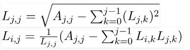

## Homework 1

### Formulation Of The Problem:
Compare the implementation of library function 
  1. np.linalg.solve for **the Gaussian elimination**,
  2. np.linalg.cholesky for **the Cholesky decomposition**,
  3. scipy.linalg.solve_banded for **the sweep algorithm**,

with your own implementation of corresponding method for solving SLE (system of linear equations) on a random matrix with a diagonal prevalence of 100 x 100, 200 x 200, etc. size. Carry out several experiments until the counting time is less than a second. Build dependency graphs. 

----------------

#### Gaussian Elimination
Gaussian elimination, also known as row reduction, is an algorithm in linear algebra for solving a system of linear equations.

Problem: solve the SLE **`Ax = f`**.

Let **A** be a square matrix. The idea refers to the factorization of **A**, with proper row and/or column orderings or permutations, into two factors – a lower triangular matrix **L** and an upper triangular matrix **U** (which has units on the main diagonal): **`A = LU`** &#8594; **`LUx = f`**.

Forward Elimination: bring the matrix to an improved upper triangular form by elementary row operations:
**`Ux = L_{-1} f`**

Back Substitution: to diagonalize matrix by elementary row transformations:
 **`x = U^{-1} L^{-1} f`** 

Gaussian elimination has arithmetic complexity of O(n3)

----------------

#### Cholesky decomposition

The Cholesky decomposition or Cholesky factorization is a decomposition of a Hermitian, positive-definite matrix into the product of a lower triangular matrix and its conjugate transpose. The Cholesky decomposition is roughly twice as efficient as the LU decomposition for solving systems of linear equations.

The Cholesky decomposition of a Hermitian positive-definite matrix **A** is a decomposition of the form **`A = [L][L]^T`**, where **L** is a lower triangular matrix with real and positive diagonal entries, and **L^T** denotes the conjugate transpose of **L**. 

The following formulas are obtained by solving above lower triangular matrix and its transpose. These are the basis of Cholesky Decomposition Algorithm :



----------------

### Project Overview 

----------------

### Files Includes With This Project:
  File          | Description
  ------------- | -------------
  gauss.py      | The program implements the gauss method.
  cholesky.py   | The program implements the cholesky method.
  sweep.py      | The program implements the sweep method.
  test.py       | The program organizes the work of all programs.

----------------

### How To Run:
```python3 test.py```

----------------

### Design Decisions:

----------------


After starting, a menu of 4 items will appear:  
    1 - Gauss method
    2 - Cholesky method
    3 - Sweep method
    q - quit

Enter one of the items and the corresponding program starts.

Output data:
    n              - matrix dimension;
    Error          - error (the infinity norm of the difference between my and numpy
                     results ||x_my - x_numpy||); 
    My time        - the time of my calculations for the matrix n*n;
    Numpy time     - the computation time of the library function for the matrix n*n.
    
----------------

The dimension of the matrix increases until the time of my calculations exceeds 
1 seconds. When the time exceeds 1 second, the calculations for the selected 
method stop and a graph is displayed. The graph shows the dependence of the time 
of calculations on the size of the matrix.

After closing the graph, the menu reappears.
