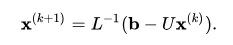

## Homework 2

### Formulation Of The Problem

Compare the implementation of library function *np.linalg.solve* for **the Jacobi method** and **the Seidel method** with your own implementation of corresponding methods for solving SLE (system of linear equations) on a random matrix with a diagonal prevalence of size 100 x 100, 200 x 200, etc. Carry out several experiments until the counting time is less than a second. Build dependency graphs. 

----------------

#### Jacobi Method

Jacobi iterative method is considered as an iterative algorithm which is used for determining the solutions for the system of linear equations in numerical linear algebra, which is diagonally dominant. In this method, an approximate value is filled in for each diagonal element. Until it converges, the process is iterated. 

Let the n system of linear equations be **`Ax = b`**. Then **`A`** can be decomposed into a diagonal component **`D`**, a lower triangular part **`L`** and an upper triangular part **`U`**:


Then **`A`** can be decomposed into a diagonal component **`D`**, a lower triangular part **`L`** and an upper triangular part **`U`**:


The solution is then obtained iteratively via:


where *`x^{k}`* is the *k*-th approximation or iteration of *`x`*  and *`x^{(k+1)}`* is the next or *`(k + 1)`* iteration of *`x`*. The element-based formula is thus:


The computation *`x_{i}^{(k+1)}`* requires each element in *`x^{k}`* except itself. 

The Jacobi method has computation complexity of *O(n2)*.

----------------

#### Gauss–Seidel Method 

The Gauss–Seidel method is an iterative technique for solving a square system of n linear equations with unknown x: **`Ax = f`** .
It is nearly similar to Jacobi method, except that each *x*-value is improved using the most recent approximations to the values of the other variables.

It is defined by the iteration: 


where *`x^{k}`* is the k-th approximation or iteration of *`x`*, *`x^{(k+1)}`* is the next or *`(k+1)`* iteration of *`x`*, and the matrix **`A`** is decomposed into a lower triangular component **`L`** and a strictly upper triangular component **`U`**: **`A=L+U`**.

The Gauss–Seidel method now solves the left hand side of this expression for *`x`*, using previous value for *`x`* on the right hand side. Analytically, this may be written as:



However, by taking advantage of the triangular form of **`L`**, the elements of *`x^{(k+1)}`* can be computed sequentially using forward substitution:


The Gauss–Seidel method has computation complexity of *O(n2)*.

----------------

### Files Includes With This Project
  File          | Description
  ------------- | -------------
  jacob.py      | The program implements the Jacobi method.
  seidel.py     | The program implements the Gauss-Seidel method.
  test.py       | The program organizes the work of all programs.

----------------

### How To Run
```python3 test.py```

----------------

### Project Overview 

The program runs in turn the methods Jacobi and Seidel. 
During the execution there are output data:

  Output data   | Description
  ------------- | -------------
  n             | Matrix dimension.
  Error         | Error (the infinity norm of the difference between my and numpy.
  My time       | Time of my calculations for the matrix nxn.
  Numpy time    | The computation time of the library function for the matrix nxn.

The dimension of the matrix increases until the time of my calculations exceeds 1 seconds. When the time exceeds 1 second, the calculations for the selected method stop and a graph is displayed. The graph shows the dependence of the time of calculations on the size of the matrix.

Example of running the program `test.py`:

 

Results and Graphs:

   Method       |      Max n        |  Error       
  ------------- | ----------------- |--------------
  Jacobi        | ~200 (< 1sec) |   3.17e-7
  Seidel        | ~2100 (< 0.1sec)  |   1.31e-7

 

----------------
