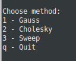

## Homework 2

### Formulation Of The Problem
Compare the implementation of library function *np.linalg.solve* for **the Jacobi method** and **the Seidel method** with your own implementation of corresponding methods for solving SLE (system of linear equations) on a random matrix with a diagonal prevalence of size 100 x 100, 200 x 200, etc. Carry out several experiments until the counting time is less than a second. Build dependency graphs. 

----------------

#### Jacobi method


Problem: solve the SLE **`Ax = f`**.

Let **A** be a square matrix. The idea refers to the factorization of **A**, with proper row and/or column orderings or permutations, into two factors – a lower triangular matrix **L** and an upper triangular matrix **U** (which has units on the main diagonal): **`A = LU`** &#8594; **`LUx = f`**.

Forward Elimination: bring the matrix to an improved upper triangular form by elementary row operations:
**`Ux = L_{-1} f`**

Back Substitution: to diagonalize matrix by elementary row transformations:
 **`x = U^{-1} L^{-1} f`** 

Gaussian elimination has arithmetic complexity of *O(n3)*.

----------------

#### Gauss–Seidel method 

The Gauss–Seidel method is an iterative technique for solving a square system of n linear equations with unknown x: **`Ax = f`** .

It is defined by the iteration: 

where *x^k* is the k-th approximation or iteration of *x*, *x^(k+1)* is the next or *(k+1)* iteration of x, and the matrix **A** is decomposed into a lower triangular component **L^{*}** and a strictly upper triangular component **U**: **`A=L_{*}+U`**.

The Gauss–Seidel method now solves the left hand side of this expression for *x*, using previous value for *x* on the right hand side. Analytically, this may be written as:


However, by taking advantage of the triangular form of **L_{*}**, the elements of *x^(k+1)* can be computed sequentially using forward substitution:


The Gauss–Seidel method has computation complexity of *O(n2)*.

----------------

#### Sweep Algorithm
In numerical linear algebra, the tridiagonal matrix algorithm, also known as the sweep algorithm, is a simplified form of Gaussian elimination that can be used to solve tridiagonal systems of equations. A tridiagonal system for *n* unknowns may be written as


For such systems, the solution can be obtained in *O(n)*.

----------------

### Files Includes With This Project
  File          | Description
  ------------- | -------------
  gauss.py      | The program implements the gauss method.
  cholesky.py   | The program implements the cholesky method.
  sweep.py      | The program implements the sweep method.
  test.py       | The program organizes the work of all programs.

----------------

### How To Run
```python3 test.py```

----------------

### Project Overview 

After starting, a menu of 4 items will appear:  
              


Enter one of the items and the corresponding program starts.

  Output data   | Description
  ------------- | -------------
  n             | Matrix dimension.
  Error         | Error (the infinity norm of the difference between my and numpy.
  My time       | Time of my calculations for the matrix nxn.
  Numpy time    | The computation time of the library function for the matrix nxn.

The dimension of the matrix increases until the time of my calculations exceeds 
1 seconds. When the time exceeds 1 second, the calculations for the selected 
method stop and a graph is displayed. The graph shows the dependence of the time 
of calculations on the size of the matrix.

After closing the graph, the menu reappears.

Example of running the program `test.py`:

 

Plot:

 

----------------


Run:
        python3 test.py

After starting, a menu of 3 items will appear: 
    1 - Jacob method
    2 - Seidel method
    q - quit

Enter one of the items and the corresponding program starts.

Output data:
    n              - matrix dimension;
    Error          - error (the infinity norm of the difference between my and numpy 
                     results ||x_my - x_numpy||); 
    My time        - the time of my calculations for the matrix n*n;
    Numpy time     - the computation time of the library function for the matrix n*n.

The dimension of the matrix increases until the time of my calculations exceeds 
0.1 seconds. When the time exceeds 0.1 second, the calculations for the selected 
method stop and a graph is displayed. The graph shows the dependence of the time 
of calculations on the size of the matrix.

After closing the graph, the menu reappears.
