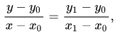
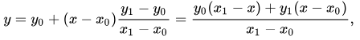
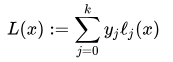
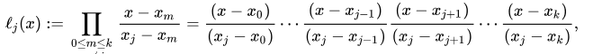
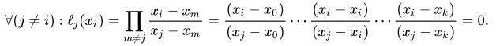
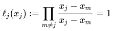
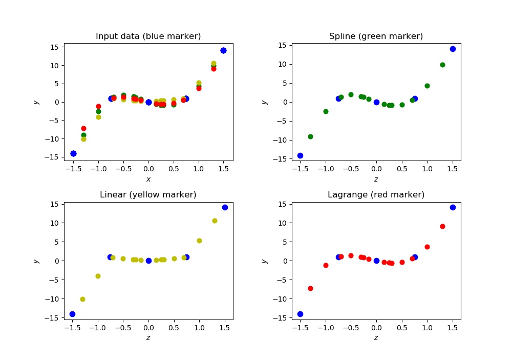

## Homework 3

### Formulation Of The Problem

Given 3 text files with numbers written in columns:

        1. train.dat - values x_0 < x_1 <...< x_n;
        2. train.ans - values y_0 < y_1 <...< y_n;
        3. test.dat - values z_0 < z_1<...<z_m.

Required to build 3 different interpolation models *`y_{i} = f(x_{i})`* on *`(x_{i}, y_{i})`*:

        1. Linear interpolationn;
        2. Lagrange interpolation;
        3. Spline interpolation. 
        
 and apply them on set of *`z_{j}`*. Output the result to files.

----------------

#### Linear Interpolation

In mathematics, linear interpolation is a method of curve fitting using linear polynomials to construct new data points within the range of a discrete set of known data points.

Linear interpolation on a set of data points *`x_{0}, y_{0}), (x_{1}, y_{1}), ..., (x_{n}, y_{n})`* is defined as the concatenation of linear interpolants between each pair of data points. Thus, it is sufficiently to consider the case for two points.

If the two known points are given by the coordinates *`(x_{0},y_{0})`* and *`(x_{1},y_{1})`*, the linear interpolant is the straight line between these points. For a value *`x`* in the interval *`(x_{0},x_{1})`*, the value y along the straight line is given from the equation of slopes



which can be derived geometrically from the figure on the right. It is a special case of polynomial interpolation with *`n = 1`*.

Solving this equation for *`y`*, which is the unknown value at *`x`*, gives



which is the formula for linear interpolation in the interval *`(x_{0},x_{1})`*. Outside this interval, the formula is identical to linear extrapolation.

----------------

#### Lagrange Interpolating Polynomial 

Lagrange Interpolating Polynomial is a method for finding the equation corresponding to a curve having some dots coordinates of it.

Given a set of *`(k + 1)`* data points *`(x_{0},y_{0}), ...,(x_{j},y_{j}), ...,(x_{k},y_{k})`* where no two *`x_{j}`* are the same, the interpolation polynomial in the Lagrange form is a linear combination



of Lagrange basis polynomials



where *0 &#8804; j &#8804; k*. Note how, given the initial assumption that no two *`x_{j}`* are the same, then (when *m &#8800; j*) *`x_{j} - x_{m}` &#8800; 0*, so this expression is always well-defined. The reason pairs *`x_{i} = x_{j}`* with *`y_{i}` &#8800; `y_{j}`* are not allowed is that no interpolation function *`L`* such that *`y_{i} = L(x_{i})`* would exist; a function can only get one value for each argument *`x_{i}`*. On the other hand, if also *`y_{i} = y_{j}`*, then those two points would actually be one single point.

For all *i &#8800; j*, *`l_{j}(x)`* includes the term *`(x - x_{i})`* in the numerator, so the whole product will be zero at *`x = x_{i}`*:



On the other hand,



In other words, all basis polynomials are zero at *`x = x_{i}`*, except *`l_{j}(x)`*, for which it holds that *`l_{j}(x_{j}) = 1`*, because it lacks the *`(x - x_{j})`* term.

It follows that *`l_{j}(x_{j}) = y_{j}`*, so at each point *`x_{j}`*, *`L(x_{j}) = y_{j} + 0 + 0 + ... + 0 = y_{j}`*, showing that *`L`* interpolates the function exactly.

----------------

### Files Includes With This Project
  File              | Description
  -------------     | -------------
  linear.py         | The program implements the linear interpolation.
  lagrange.py       | The program implements the lagrange interpolation.
  spline.py         | The program organizes the spline interpolation.
  test.py           | The program organizes the work of all programs.
  train.dat         | Input data for *x* values.
  train.ans         | Input data for *y* values.
  test.dat          | Input data for *z* values.
  test_spline.ans   | The result of spline interpolation for the set of values *z*.
  test_linear.ans   | The result of linear interpolation for the set of values *z*.
  test_lagrange.ans | The result of lagrange interpolation for the set of values *z*.
  result.jpg        | The plot with input points and output poits of each interpolation method.
  
----------------

### How To Run
```python3 test.py```

----------------

### Project Overview 
        
In this program, calculations are made immediately for three interpolation models.
 
Input data:

        train.dat  - x values
        train.ans  - y values
        test.dat   - points at which the function values should be restored.
        
Output data:

        test_linear.ans     - linear interpolation calculation results (for test.dat points)
        test_lagrange.ans   - lagrange interpolation calculation results (for test.dat points)
        test_spline.ans     - spline interpolation calculation results (for test.dat points)

At the end, 4 graphs are displayed: 
* **Upper left plot** - all interpolations:

        - blue markers: input points;
        - green markers: points for spline interpolation;
        - yellow markers: points for linear interpolation;
        - red markers: points for lagrange interpolation.
        
* **Upper right plot** - spline interpolation: 

        - blue markers: input points;
        - green markers: points for spline interpolation.

* **Lower left plot** - linear interpolation: 

        - blue markers: input points;
        - yellow markers: points for linear interpolation.
        
* **Lower right plot** - lagrange interpolation: 

        - blue markers: input points;
        - red markers: points for lagrange interpolation.



