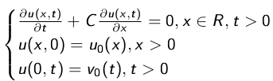

## Homework 4

### Formulation Of The Problem

  1. Implement the transport equation:

      &nbsp;&nbsp;&nbsp;&nbsp;&nbsp;&nbsp;  

where *C = 1*, 

Analytical solution:     
&nbsp;&nbsp;&nbsp;&nbsp;&nbsp;&nbsp; .


  2. Implement the heat equation:

&nbsp;&nbsp;&nbsp;&nbsp;&nbsp;&nbsp; 

where  &nbsp;&nbsp;&nbsp;&nbsp;&nbsp;&nbsp; 

Analytical solution:   &nbsp;&nbsp;&nbsp;&nbsp;&nbsp;&nbsp;     


Output a GIF image of the obtained solution for each equation.

----------------

#### Transport Equation

The transport equation describes how a scalar quantity is transported in a space. Usually, it is applied to the transport of a scalar field (e.g. chemical concentration, material properties or temperature) inside an incompressible flow. From the mathematical point of view, the transport equation is also called the convection-diffusion equation, which is a first-order PDE (partial differential equation). The convection-diffusion equation is the basis for the most common transportation models.

Given the initial profile function *`u_{0}(x)`* and the transfer rate *`C`*. Find the profile position *`u(x,T)`* at a predetermined point in time *`T`*.



Solution:


----------------

#### Heat Equation 
In physics and mathematics, the heat equation is a partial differential equation that describes how the distribution of some quantity (such as heat) evolves over time in a solid medium, as it spontaneously flows from places where it is higher towards places where it is lower. It is a special case of the diffusion equation.

Given the initial profile function *`u_{0}(x)`* and the transfer rate &mu;. Find the profile at a random point in time *`T`*.


Solution:


----------------

### Files Includes With This Project
  File              | Description
  -------------     | -------------
  heat.py           | The program implements the heat equation.
  transport.py      | The program implements the transport equation.
  heat1.gif         | The GIF-file to show the implementation of heat equation.
  transfer.gif      | The GIF-file to show the implementation of transport equation.
  
----------------

### How To Run
The heat equation:
```python3 test.py```

The transport equation:
```python3 test.py```

----------------

### Project Overview 
        
The programs works separately. 
 
Input data:

        n  -  amount of steps for x axis;
        m  -  amount of steps for t axis;
        
        
Output data:

  * GIF-file for transport equation:
  
    
    
  * GIF-file for heat equation:
  
    

