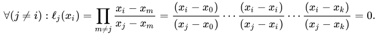

## Homework 3

### Formulation Of The Problem

  1. Implement the transport equation:

      &nbsp;&nbsp;&nbsp;&nbsp;&nbsp;&nbsp;  

where *C = 1*,    &nbsp;&nbsp;&nbsp;&nbsp;&nbsp;&nbsp;  

Analytical solution:     &nbsp;&nbsp;&nbsp;&nbsp;&nbsp;&nbsp; .


  2. Implement the heat equation:


where   

Analytical solution:        


Output a GIF image of the obtained solution for each equation.

----------------

#### Linear Interpolation


----------------

#### Lagrange Interpolating Polynomial 


of Lagrange basis polynomials





----------------

### Files Includes With This Project
  File              | Description
  -------------     | -------------
  linear.py         | The program implements the linear interpolation.
  lagrange.py       | The program implements the lagrange interpolation.
  spline.py         | The program organizes the spline interpolation.
  test.py           | The program organizes the work of all programs.
  train.dat         | Input data for *x* values.
  train.ans         | Input data for *y* values.
  test.dat          | Input data for *z* values.
  test_spline.ans   | The result of spline interpolation for the set of values *z*.
  test_linear.ans   | The result of linear interpolation for the set of values *z*.
  test_lagrange.ans | The result of lagrange interpolation for the set of values *z*.
  result.jpg        | The plot with input points and output poits of each interpolation method.
  
----------------

### How To Run
```python3 test.py```

----------------

### Project Overview 
        
In this program, calculations are made immediately for three interpolation models.
 
Input data:

        train.dat  - x values
        train.ans  - y values
        test.dat   - points at which the function values should be restored.
        
Output data:

        test_linear.ans     - linear interpolation calculation results (for test.dat points)
        test_lagrange.ans   - lagrange interpolation calculation results (for test.dat points)
        test_spline.ans     - spline interpolation calculation results (for test.dat points)

At the end, 4 graphs are displayed: one for the starting points (x, y), the others
for points obtained as a result of the operation of each interpolation model.


To run an advection equation:
            python3 advection.py
 
To run a heat equation:
            python3 advection.py           
            
Each program requires the entry of values n and m.
            
heat1.gif     -  example of heat.py program.
transfer1.gif  -  example of advection.py program.
